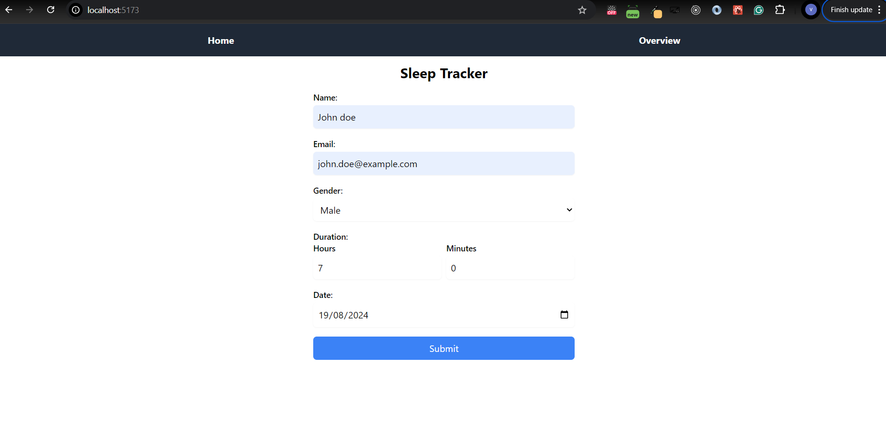

# Sleep Tracker App

This is the Sleep Tracker application.

# Home page

# Overview page

## Run Locally

### Server

- Navigate to server application `cd /server` in terminal
- Install dependencies by running `npm i` in terminal
- Start the DB (Postgresql) container with `docker compose up`
- Create .env file and copy `.env.example` to `.env`
 
- **TODO**: What else is needed?
- Finally start the server with `npm run dev`

### Client

- Navigate to client application folder `cd /client`
- Install dependencies by running `npm i`
- Create .env file and copy `.env.example` to `.env`
- Run `npm run dev` in terminal

# Sleep Tracker App - Potential Improvements and Additional Features

## Major Changes Required

### 1. Authentication & Authorization

- **Authentication:**
  Ensure users are authenticated before they can add, edit, or view data. This can be implemented using various methods such as JWT tokens, OAuth, or session-based authentication.

- **Authorization:**
  Currently, all users have the same level of access, which allows them to add, edit, and view sleep records. As the app scales, consider implementing different user roles (such as admins, read-only users, etc.) to manage access control more effectively.

### 2. Database Schema Adjustments

- **Track Modifications:**
  Add fields to the `SleepRecord` model to track who created or last modified a record (e.g., `createdBy`, `updatedBy`).

- **Public vs. Private Records:**
  Introduce a `public` boolean flag in the `SleepRecord` model to differentiate between public and private records, if needed.

### 3. API Security Enhancements

- **Allow Editing/Adding:**
  Update the API to allow authenticated users to edit or add records with appropriate validation and limits.

- **Allow Viewing:**
  Update the API to allow only authorized users to view records. Implement pagination, rate limiting, and other techniques to manage load effectively.

### 4. Frontend Updates

- **Edit/Add UI:**
  Update the UI to enable users to add or edit records. Implement form validation and user feedback.

- **View All Records:**
  Create a public view that lists all sleep records, potentially sorted by date or user.

### 5. Privacy Considerations

- **Data Privacy:**
  Consider adding a user opt-in for sharing data publicly. Users should be informed about how their data will be used and displayed.

- **Anonymization:**
  If user data is made public, implement measures to anonymize the data, such as using pseudonyms.

### 6. Notification System

- Implement a notification system to alert users when their records are edited by someone else (e.g., via email or in-app notifications).

### 7. Audit Log

- Implement an audit log to track who added or modified records, helping with troubleshooting and maintaining data integrity.

### 8. Testing

- **Test Cases:**
  Implement comprehensive test cases to ensure the app functions correctly, especially in scenarios involving multiple users adding or editing records simultaneously.

## Additional Features

### 1. Sleep Quality Analysis
- **Description:** Implement a feature that allows users to input or automatically track sleep quality metrics such as restfulness, interruptions, and dream recall. 
- **Value:** This feature would provide users with deeper insights into their sleep patterns, helping them identify factors affecting their sleep quality.

### 2. Integration with Wearable Devices
- **Description:** Integrate the app with wearable devices like smartwatches or fitness trackers to automatically gather sleep data.
- **Value:** Automated data collection would improve the accuracy of sleep tracking and reduce the effort required by users to log their sleep manually.

### 3. Sleep Recommendations and Insights
- **Description:** Based on users' sleep data, the app could offer personalized sleep recommendations, such as ideal bedtimes, relaxation techniques, or adjustments to sleep environment.
- **Value:** Providing actionable insights and recommendations could help users improve their sleep habits and overall health.

### 4. Social Sharing and Community Features
- **Description:** Enable users to share their sleep achievements or challenges with friends or within a community of users.
- **Value:** Social features could increase user engagement and motivation by allowing users to connect with others who have similar sleep goals.

## Improvements

### 1. Enhanced Data Visualization
- **Description:** Improve the app's data visualization capabilities by adding more detailed and interactive charts, such as weekly/monthly trends, correlations between sleep duration and quality, etc.
- **Impact:** Better data visualization would help users understand their sleep patterns more clearly and make more informed decisions.

### 2. Optimized Performance and Scalability
- **Description:** Optimize the app's backend to handle large volumes of data efficiently, particularly as the user base grows.
- **Impact:** Ensuring that the app remains responsive and reliable, even with a large number of users, would improve user experience and retention.

### 3. Comprehensive Testing Suite
- **Description:** Develop a more extensive testing suite that includes unit tests, integration tests, and end-to-end tests for both the frontend and backend.
- **Impact:** This would increase the reliability of the app and reduce the likelihood of bugs or issues in production.

### 4. Improved User Interface (UI) and User Experience (UX)
- **Description:** Refine the UI design to make it more intuitive, visually appealing, and accessible. Consider adding features like dark mode, customizable themes, and more user-friendly navigation.
- **Impact:** A better-designed UI/UX would enhance user satisfaction and make the app more appealing to a broader audience.

## Technical Considerations

### 1. Scalability
- **Consideration:** With more time, consider optimizing database queries, improving caching mechanisms, and using a more scalable architecture (e.g., microservices) to ensure the app can handle increased user load.

### 2. Security Enhancements
- **Consideration:** Implement stricter authentication methods, such as multi-factor authentication (MFA), and ensure that all sensitive user data is encrypted both in transit and at rest.

### 3. Integration with Third-Party Services
- **Consideration:** Explore integrating the app with third-party health APIs (like Apple Health or Google Fit) to provide users with a more comprehensive view of their health and wellness.

